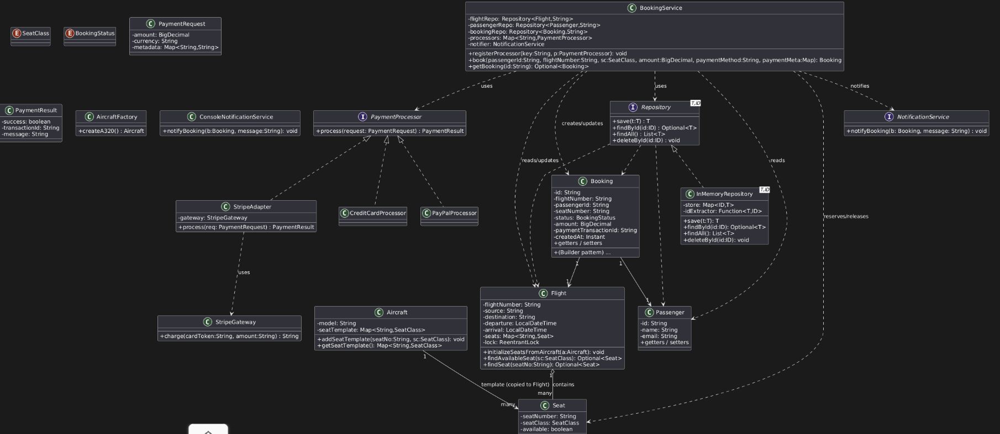
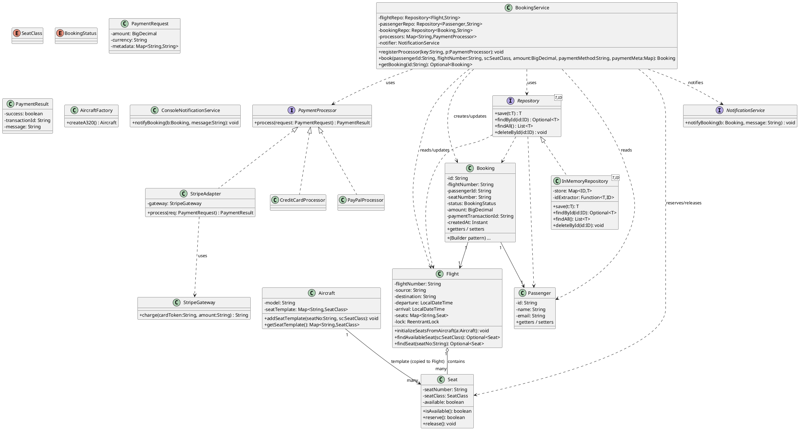
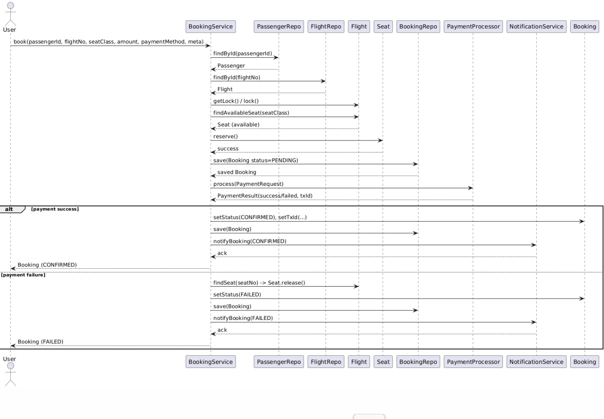
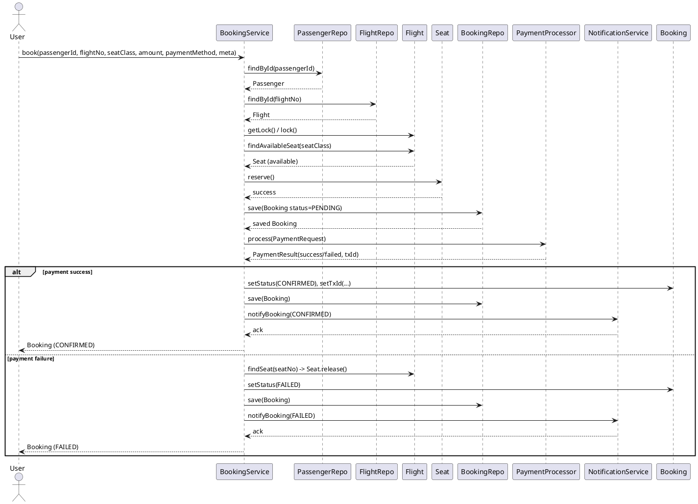

1. **Class diagram** (shows classes, interfaces, attributes & major methods, and relationships)
2. **Sequence diagram** for the main booking flow (reserve seat → create booking → process payment → confirm/rollback)

I’ll also add a short mapping from the UML elements to the Java classes I provided earlier and a few extension notes.

---

# Class diagram (PlantUML)

---

# Sequence diagram (PlantUML)

---

# Mapping of UML elements → Java files (quick)

* `BookingService` → `com.example.airline.service.BookingService`
* `Flight`, `Seat`, `Aircraft` → `com.example.airline.model.*`
* `Booking`, `Passenger` → `com.example.airline.model.*`
* `PaymentProcessor`, implementations → `com.example.airline.payment.*`
* `Repository` / `InMemoryRepository` → `com.example.airline.repo.*`
* `NotificationService`, `ConsoleNotificationService` → `com.example.airline.service.*`
* `AircraftFactory` → `com.example.airline.service.AircraftFactory`

---

# Notes & extension suggestions (for the diagram)

* If you add a **LoyaltyService** later, model it as an Observer: `BookingService` will emit an event or call `LoyaltyService.awardPoints(Booking)` after confirmation. In UML add `<<observer>> LoyaltyService` and a dependency arrow from `BookingService`.
* For **multi-leg itineraries**, introduce `Itinerary` composed of `FlightLeg` (each leg points to `Flight`) and show `Booking` referencing `Itinerary` (composition).
* For DB-backed implementation, replace `InMemoryRepository` with `JpaRepository` (stereotype `<<repository>>`) and show `BookingService` calls wrapped in a transaction (annotate method with `<<transaction>>`).

---
